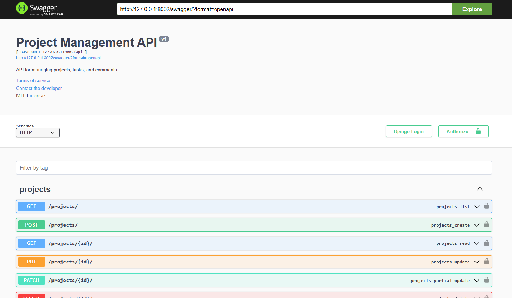

<div align="center">

<h1> Project Management API</h1>

<p> A REST API for managing projects, tasks, and comments built with Django REST Framework and JWT authentication with Swagger documentation. </p>

<p>


</p>



</div>

## Table of Contents

- [Features](#features)
- [Prerequisites](#prerequisites)
- [Technologies](#technologies)
- [Installation](#installation)
- [API Endpoints](#api-endpoints)
- [Authentication](#authentication)
- [Models](#models)
- [License](#license)
- [Contributors](#contributors)

## Features

- User authentication with JWT tokens
- Project management (CRUD operations)
- Task management with priority and status tracking
- Comment system for tasks
- Nested routing for better resource organization
- API documentation with Swagger UI

## Prerequisites

- Python 3.8+
- pip (Python package manager)

## Technologies

- Django REST Framework
- Django
- SQLite
- JWT (JSON Web Token) authentication
- Swagger (API documentation)


## Installation

1. Clone the repository:
```bash
git clone https://github.com/MusfiqDehan/Project-Management-Tool.git
cd Project-Management-Tool
```
2. Create a virtual environment and activate it:
```bash
python -m venv venv
source venv/bin/activate  # On Windows: venv\Scripts\activate
```
3. Install the dependencies:
```bash
pip install -r requirements.txt
```
4. Run the migrations:
```bash
python manage.py migrate
```
5. Create a superuser:
```bash
python manage.py createsuperuser
```
6. Start the development server:
```bash
python manage.py runserver
```
The API will be available at http://localhost:8000/api/ Swagger documentation is available at http://localhost:8000/swagger/

## API Endpoints

### Authentication
- `POST /api/users/register/` - Register a new user
- `POST /api/users/login/`  - Login user
- `POST /api/token/` - Obtain JWT token pair
- `POST /api/token/refresh/` - Refresh JWT token
- `POST /api/token/verify/` - Verify JWT token

### Users
- `GET /api/users/` - List all users
- `GET /api/users/{id}/` - Retrieve a user
- `PUT /api/users/{id}/` - Update a user
- `DELETE /api/users/{id}/` - Delete a user

### Projects
- `GET /api/projects/` - List all projects
- `POST /api/projects/` - Create a new project
- `GET /api/projects/{id}/` - Retrieve a project
- `PUT /api/projects/{id}/` - Update a project
- `DELETE /api/projects/{id}/` - Delete a project

### Tasks
- `GET /api/projects/{project_id}/tasks/` - List all tasks in a project
- `POST /api/projects/{project_id}/tasks/` - Create a new task
- `GET /api/projects/{project_id}/tasks/{id}/` - Retrieve a task
- `PUT /api/projects/{project_id}/tasks/{id}/` - Update a task
- `DELETE /api/projects/{project_id}/tasks/{id}/` - Delete a task

### Comments
- `GET /api/projects/{project_id}/tasks/{task_id}/comments/` - List all comments
- `POST /api/projects/{project_id}/tasks/{task_id}/comments/` - Create a comment
- `GET /api/projects/{project_id}/tasks/{task_id}/comments/{id}/` - Retrieve a comment
- `PUT /api/projects/{project_id}/tasks/{task_id}/comments/{id}/` - Update a comment
- `DELETE /api/projects/{project_id}/tasks/{task_id}/comments/{id}/` - Delete a comment

## Authentication
The API uses JWT (JSON Web Token) authentication. To access protected endpoints:

1) Register a new user or login to get the JWT tokens
2) Include the access token in the Authorization header:
```bash
Authorization: Bearer <your_access_token>
```
3) Refresh the access token using the refresh token when it expires

## Models
### User
- username: string
- email: string (unique)
- first_name: string
- last_name: string
- password: string

### Project
- name: string
- description: text (optional)
- owner: User reference
- created_at: datetime

### Task
- title: string
- description: text (optional)
- status: string (TODO, IN_PROGRESS, DONE)
- priority: string (LOW, MEDIUM, HIGH)
- assigned_to: User reference (optional)
- project: Project reference
- created_at: datetime
- due_date: datetime (optional)

### Comment
- content: text
- user: User reference
- task: Task reference
- created_at: datetime

## License
MIT-licensed. [See LICENSE](LICENSE)

## Contributors
Maintained by [Md. Musfiqur Rahaman](https://github.com/musfiqdehan)
